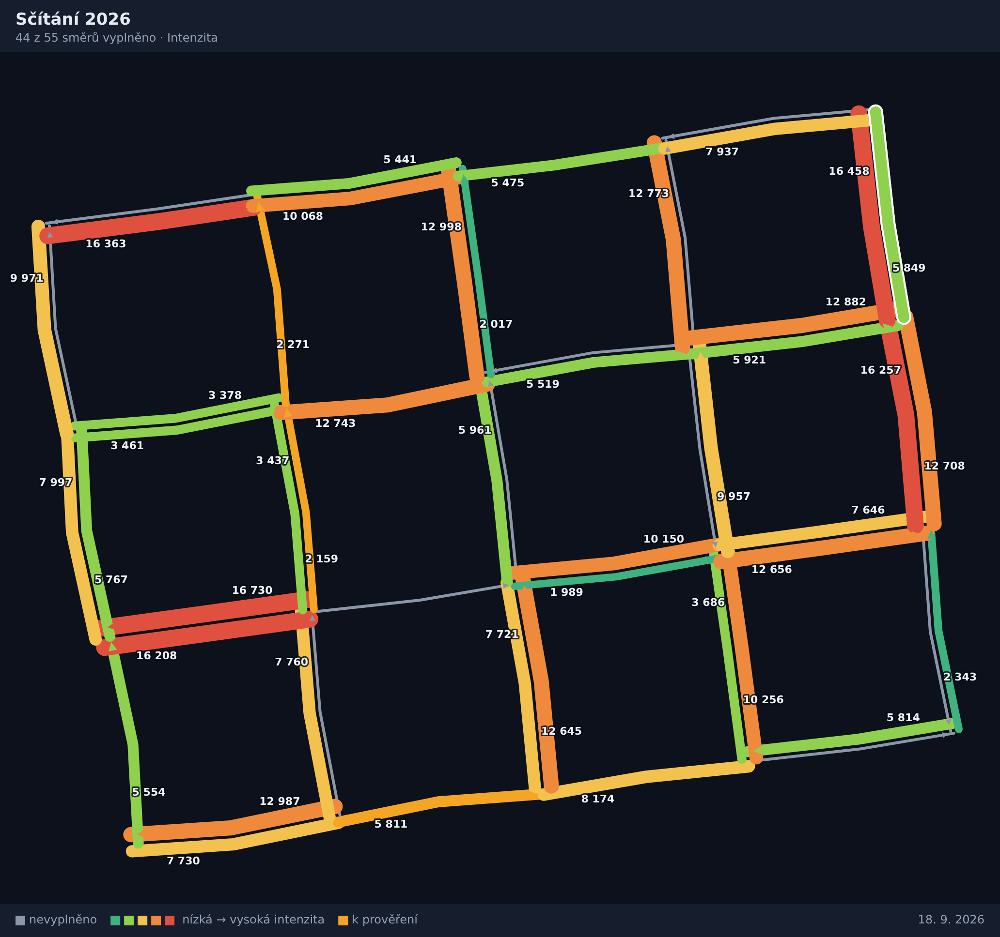

# TrafficVolumes

Ruční zadávání intenzit dopravy na linky z **PTV Visum** — v mapě, po směrech,
**bez licence Visum a bez jakékoli instalace**. Celá aplikace je jeden HTML
soubor, který se otevře dvojklikem v prohlížeči. Výsledek se vrací do Visumu
jako uživatelský atribut na linku.

Typický scénář: vy máte licenci Visum a exportujete síť. Kolega nebo sčítač
licenci nemá — dostane e‑mailem jeden soubor, proklikává v mapě jednotlivé
směry a zapisuje intenzity. Vy si pak hotová data načtete zpět do Visumu.


## Rychlý start

1. Otevřete **[`dist/TrafficVolumes.html`](dist/TrafficVolumes.html)** v prohlížeči
   (stačí dvojklik, funguje i z flash disku, offline).
2. Přetáhněte do okna export linků z Visumu (`.att`, `.net`, `.csv`, `.geojson`).
3. Klikejte v mapě na směry linků a zapisujte intenzity.

Nic se nikam neodesílá — soubor běží celý ve vašem prohlížeči, žádný server.

## Jak se data ukládají

Tohle je nejdůležitější část, tak popořadě od nejbezpečnějšího:

| Způsob | Kdy se použije | K čemu |
| --- | --- | --- |
| **Automaticky do prohlížeče** | sám od sebe po každém zápisu | pojistka proti zavření okna nebo pádu; při dalším otevření aplikace nabídne „Pokračovat“ |
| **Průběžně do souboru** | tlačítko *Průběžně ukládat do souboru…* | vyberete soubor na disku a aplikace do něj od té chvíle sama zapisuje každou změnu (Chrome, Edge) |
| **Uložit práci (HTML)** | tlačítko | jeden soubor se sítí i daty — tímhle se práce **předává zpátky vám**; dvojklikem se otevře přesně tam, kde sčítač skončil |
| **CSV** | tlačítko | pro váš vlastní skript do Visumu |
| **`.att`** | tlačítko | Visum ho načte přímo, bez skriptování |
| **PNG kartogram** | tlačítko | obrázek do zprávy, ne datový kanál |

Jinými slovy: **CSV není úložiště, ale export.** Data drží autosave a uložený
HTML soubor; CSV a `.att` si stahujete, až když jsou hotová.

Tlačítko *PNG kartogram* vygeneruje obrázek aktuálního výřezu s legendou:



## Export do Visumu

### Varianta A — přímo (bez skriptování)

1. V aplikaci klikněte na **`.att` pro Visum**.
2. Ve Visumu vytvořte na objektu **Link** uživatelské atributy — v seznamu
   linků pravým tlačítkem na záhlaví sloupce → *User-defined attributes…*
   Použijte **přesně** ID a typy vypsané v hlavičce staženého `.att`
   (např. `VOL_MANUAL`, typ *Integer*).
3. Načtěte soubor atributů (`File > Import > Attribute file…`; v některých
   verzích *„Read attribute file“* přímo ze seznamu linků).

Soubor má tvar:

```
$LINK:NO;FROMNODENO;TONODENO;VOL_MANUAL
1;10;11;12500
1;11;10;9800
```

Klíčové sloupce `NO;FROMNODENO;TONODENO` adresují **jeden konkrétní směr**
linku, takže každý směr si ponese svou hodnotu. Nevyplněné směry se
nezapisují, aby Visum nepřepsalo stávající hodnoty prázdnou hodnotou
(pokud je chcete, zaškrtněte *exportovat i nevyplněné směry*).

Tlačítko **Visum skript** stáhne hotový Python skript, který kroky 2 a 3 udělá
sám — spustíte ho ve Visumu přes `Scripts > Run script file…`.

### Varianta B — vlastní skript

Tlačítko **CSV** stáhne středníkem oddělený soubor v UTF‑8 s BOM
(Excel ho otevře do sloupců):

```
NO;FROMNODENO;TONODENO;NAME;VOL_MANUAL;NOTE;SURVEYOR;UPDATED_AT
1;10;11;Husova;12500;ruční sčítání;Novák;2026-09-18T08:49:20.000Z
```

## Co exportovat z Visumu

Nejjednodušší je **uložit síť jako `.net`** — obsahuje tabulky `$NODE`,
`$LINK` a `$LINKPOLY`, ze kterých se geometrie sestaví sama a nemusíte nic
vybírat.

Druhá možnost je export seznamu linků do `.att`: otevřete seznam linků
(`Lists > Network > Links`), nechte v něm alespoň sloupce

```
NO   FROMNODENO   TONODENO   WKTPOLY
```

a přidejte, co se má sčítajícímu zobrazovat jako kontext (`NAME`, `TYPENO`,
`NUMLANES`, `CAPPRT`, `V0PRT`…) — všechny sloupce se mu ukážou v panelu
*Atributy z Visumu*. Seznam pak uložte jako soubor atributů (`*.att`).

> Když `WKTPOLY` nemáte, stačí místo něj `FromNode\XCoord`, `FromNode\YCoord`,
> `ToNode\XCoord`, `ToNode\YCoord` — linky se vykreslí jako úsečky.

Aplikace přečte i CSV export a GeoJSON. Kódování `cp1250` i UTF‑8 rozpozná sama.

## Souřadnicové systémy

Rozpoznají se automaticky, ale při zakládání projektu je můžete přepsat:

- **S‑JTSK / Krovák East North (EPSG:5514)** — nejběžnější u českých sítí,
- **S‑JTSK / Krovák jih‑západ (EPSG:5513, 2065)**,
- **WGS84 (EPSG:4326)**, **Web Mercator (EPSG:3857)**,
- **místní / neznámý** — síť se zobrazí v rovinném plátně bez podkladové mapy;
  zadávání funguje úplně stejně.

Krovák je implementovaný přímo v aplikaci včetně transformace datumu
Bessel → WGS84, takže síť sedí na podkladovou mapu na desítky centimetrů.
(Ověřeno proti oficiálnímu příkladu z EPSG Guidance Note 7‑2 a proti PROJ.)

## Zadávání

- Kliknutí v mapě vybere směr linku. Každý směr je samostatná čára odsazená
  **vpravo ve směru jízdy**, se šipkou — obousměrný link jsou tedy dvě čáry.
- <kbd>Enter</kbd> uloží, <kbd>N</kbd> skočí na nejbližší nevyplněný směr,
  <kbd>O</kbd> přepne na opačný směr, <kbd>Esc</kbd> zruší výběr.
- Tlačítko *Kopírovat →opačný* zapíše stejné hodnoty i do protisměru.
- Zadat lze víc veličin naráz (např. celkem / nákladní / špičková hodina) —
  nastavíte je při zakládání projektu; název veličiny se stane ID
  uživatelského atributu ve Visumu.
- Čísla se přijímají i s desetinnou čárkou (`48,5`) a s mezerami
  (`12 500`). Poznámka a příznak *k prověření* jsou u každého směru.

## Více sčítajících

Každý dostane kopii uloženého HTML, vyplní svou část a pošle soubor zpět.
Sloučení: otevřete svůj projekt a tlačítkem **Načíst hodnoty…** postupně
načtěte soubory od ostatních — bere `.html`, `.json`, `.csv` i `.att`.

## Prohlížeče

Testováno v prohlížečích založených na Chromiu (Chrome, Edge). Ve Firefoxu a
Safari funguje zadávání i všechny exporty; průběžný zápis do souboru je jen
v Chrome a Edge (jinde je tlačítko neaktivní a použije se *Uložit práci*).

Velikost není problém: síť s 21 300 směry se načte za ~0,2 s, mapa se
překresluje v jednotkách až desítkách milisekund a uložený HTML soubor má
kolem 6,5 MB.

## Vývoj

Aplikace se skládá z modulů v `src/`; `dist/TrafficVolumes.html` je z nich
sestavený jednosouborový výstup.

```bash
python3 build.py              # src/ -> dist/TrafficVolumes.html
node --test tests/js/         # 54 unit testů (projekce, parser, projekt, export)
```

| Modul | Obsah |
| --- | --- |
| `src/01-projection.js` | Krovák, Helmertova transformace datumu, Web Mercator, rozpoznání systému |
| `src/02-parser.js` | čtení `.att` / `.net` / CSV / GeoJSON, WKT, kódování |
| `src/03-project.js` | stav projektu, validace hodnot, historie změn |
| `src/04-autosave.js` | IndexedDB + průběžný zápis do souboru |
| `src/05-export.js` | CSV, `.att`, GeoJSON, PNG, samostatné HTML |
| `src/06-map.js` | vykreslování mapy na canvasu, odsazení směrů, výběr |
| `src/07-ui.js` | obrazovky a ovládání |

`samples/sample_links.att` je malá vzorová síť v S‑JTSK, na které si lze celý
postup vyzkoušet.

## Volitelné: nástroje pro příkazovou řádku

Ve složce `trafficvolumes/` je navíc Python varianta téhož (CLI + lokální
server) pro dávkové zpracování na vaší straně — hromadné zakládání projektů,
slučování a export skriptem. Pro samotné sčítání není potřeba; sčítající
vystačí s jedním HTML souborem.

```bash
python3 -m trafficvolumes create sit.att -o scitani.tvol
python3 -m trafficvolumes export scitani.tvol -o intenzity
python3 -m unittest discover -s tests   # 114 testů
```

## Licence

MIT.
