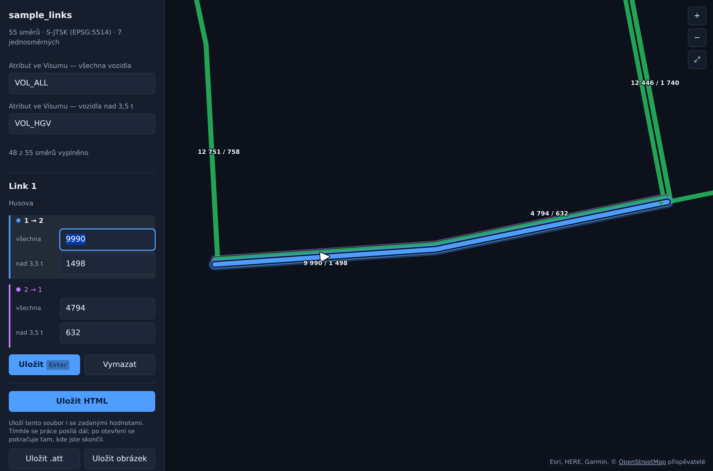

# TrafficVolumes

Jednostránková HTML aplikace pro ruční zadávání intenzit dopravy na linky
z **PTV Visum**. Uživatel nepotřebuje licenci Visum, Python ani nic
nainstalovaného — stačí prohlížeč.



## Spuštění

Stáhněte **[`TrafficVolumes.html`](TrafficVolumes.html)** a otevřete dvojklikem.
To je celé. Funguje offline i z flash disku, nic se nikam neodesílá.

## Použití

1. **Přetáhněte do okna export linků z Visumu** — `.att`, `.net`, `.csv`
   nebo `.geojson`.
2. **Klikněte na link v mapě.** V panelu se objeví oba směry
   (`19 → 20` a `20 → 19`) a do každého se zapíše jeho intenzita.
   <kbd>Enter</kbd> uloží.

   Každý směr má svou barvu — **modrou** a **fialovou** — a stejnou barvu má
   puntík u jeho políčka. Směr, ve kterém právě píšete, je v mapě obtažený
   silněji, takže je pořád zřejmé, které číslo kam patří.
3. **Uložit .att** stáhne soubor pro Visum, **Uložit obrázek** kartogram v PNG.

Do políčka *Název atributu ve Visumu* zadejte, jak se má sloupec jmenovat
(výchozí `VOL_MANUAL`).

Přepínač **podkladová mapa** podloží síť mapou z OpenStreetMap. Vyžaduje
připojení k internetu; když se dlaždice nenačtou, aplikace to napíše a pracuje
se dál nad tmavým pozadím. U sítí v neznámém souřadnicovém systému se přepínač
nenabízí, protože dlaždice by neseděly.

Dlaždice se načítají stejně jako v Leafletu nebo Folium, takže fungují všude,
kde funguje ta. Aplikace se jen na začátku jednou zeptá, zda server posílá
hlavičky CORS: když ano, dostane se podkladová mapa i do uloženého obrázku;
když ne, zobrazí se v aplikaci, ale obrázek se uloží bez ní (prohlížeč jinak
odmítne plátno přečíst) a aplikace to napíše.

Pokud je ve vaší síti OpenStreetMap nedostupná, přepište v souboru
`TrafficVolumes.html` konstantu `TILE_URL` na adresu svého vlastního
dlaždicového serveru ve tvaru `.../{z}/{x}/{y}.png`. Je hned na začátku
skriptu.

**Zadané hodnoty nikam neodcházejí a nikde nezůstávají.** Drží se jen
v otevřené stránce, nezapisují se do HTML souboru ani do prohlížeče. Ze
stránky se dostanou výhradně tlačítky *Uložit .att* a *Uložit obrázek* —
proto je uložte dřív, než okno zavřete.

## Načtení do Visumu

Stažený `.att` vypadá takto:

```
$LINK:NO;FROMNODENO;TONODENO;VOL_DEN
1;10;11;12500
1;11;10;9800
```

Klíčové sloupce `NO;FROMNODENO;TONODENO` adresují **jeden konkrétní směr**
linku, takže každý směr si nese svou hodnotu. Ve Visumu:

1. Vytvořte na objektu **Link** uživatelský atribut se stejným názvem
   (`VOL_DEN`, typ *Integer*) — v seznamu linků pravým tlačítkem na záhlaví
   sloupce → *User-defined attributes…*
2. Načtěte soubor atributů (`File > Import > Attribute file…`; v některých
   verzích *„Read attribute file“* přímo ze seznamu linků).

Soubor je čisté ASCII s konci řádků CRLF, takže na něm kódování cp1250
nemá co zkazit.

## Co exportovat z Visumu

Nejjednodušší je **uložit síť jako `.net`** — obsahuje tabulky `$NODE`,
`$LINK` a `$LINKPOLY`, ze kterých se geometrie sestaví sama.

Druhá možnost je seznam linků (`Lists > Network > Links`) uložený jako `.att`,
který obsahuje alespoň:

```
NO   FROMNODENO   TONODENO   WKTPOLY
```

Místo `WKTPOLY` postačí i `FromNode\XCoord`, `FromNode\YCoord`,
`ToNode\XCoord`, `ToNode\YCoord` — linky se pak vykreslí jako úsečky.

### Jak se poznají oba směry

Visum exportuje linky třemi způsoby a aplikace si poradí se všemi:

1. **Protisměr ve stejném řádku.** Seznam linků s atributy relace *ReverseLink*
   má vedle `FROMNODENO`/`TONODENO` i `R_FROMNODENO`, `R_TONODENO`,
   `R_TSYSSET`… Druhý směr se vezme odtud. Rozpozná se prefix `R_`, `REV_`,
   `REVERSE_` i `REVERSELINK\`.
2. **Každý směr jako vlastní řádek** (prohozené `FROMNODENO`/`TONODENO`).
   Bere se tak, jak je.
3. **Jeden řádek na link, bez informace o protisměru.** Druhý směr se doplní
   s obrácenou geometrií a v hlavičce je napsáno *oba směry doplněny k N linkům*.

**Jednosměrky** se poznají podle `TSYSSET`: prázdná množina dopravních systémů
znamená, že je směr uzavřený, a takový směr se nenabízí. Když jsou uzavřené
oba směry, export o skutečném provozu nic neříká a link zůstane obousměrný,
aby z mapy nezmizel.

Totéž platí pro GeoJSON i CSV — rozhodují názvy sloupců, ne formát souboru.

## Souřadnicové systémy

Rozpoznají se samy: **S‑JTSK / Krovák** (EPSG:5514 i 5513) a **WGS84**
(včetně souřadnic se třetím rozměrem, který se ignoruje).
Krovák je spočítaný přímo v aplikaci včetně transformace datumu
Bessel → WGS84 (ověřeno proti příkladu z EPSG Guidance Note 7‑2 a proti PROJ).
Neznámý systém se zobrazí v rovinném plátně — zadávání funguje stejně.

## Mapa

Každý směr je samostatná čára odsazená **vpravo ve směru jízdy**, se šipkou.
Šířka a barva odpovídají zadané intenzitě, nevyplněné směry jsou šedé.
Vybraný link má oba směry obtažené barvou podle panelu, editovaný silněji.
Táhnutím se posouvá, kolečkem přibližuje, <kbd>Esc</kbd> zruší výběr.

Obrázek uložený tlačítkem obsahuje i podkladovou mapu, pokud je zapnutá
a pokud to server dlaždic dovolí (viz výše).

## Test

```bash
pip install playwright && playwright install chromium
python3 tests/e2e.py      # 58 kontrol celé aplikace
python3 tests/tiles.py    # podkladová mapa proti lokálnímu serveru
```

`e2e.py` projde aplikaci v prohlížeči jako uživatel: načtení sítě ve všech
podporovaných podobách, zadání obou směrů, zvýraznění editovaného směru,
validaci čísel, jednosměrné linky, obsah `.att` i PNG.

`tiles.py` si spustí vlastní dlaždicový server, takže nepotřebuje internet,
a ověří chování s hlavičkami CORS, bez nich i při nedostupném serveru.

## Licence

MIT.
